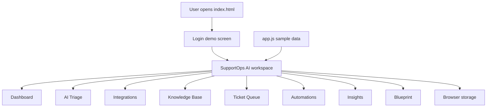
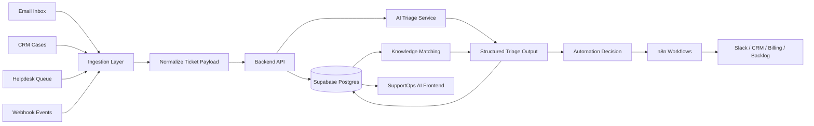
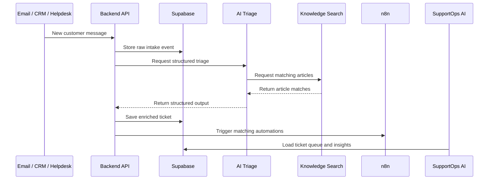

# Architecture

SupportOps AI is currently a static frontend MVP.

The architecture is intentionally simple today so the product workflow can be reviewed without credentials, backend setup, or paid APIs.

The target architecture is a real customer support intelligence system with data intake, AI triage, knowledge matching, workflow automation, and operational reporting.

## Architecture Goals

The app is designed to answer five support operations questions:

1. What customer issues need attention now?
2. Which tickets carry SLA, sentiment, billing, access, or operational risk?
3. What SOP or knowledge article should the agent use?
4. What automation should happen next?
5. Which recurring issues should become process improvement work?

## Current MVP Architecture

Current implementation:

- Static HTML page
- CSS-based responsive interface
- Vanilla JavaScript application state
- Local sample data for tickets, articles, integrations, and automation rules
- Deterministic AI-style triage logic
- Browser storage for demo persistence



## Current Data Flow

The current MVP uses JavaScript objects in `app.js`.

The app loads:

- Sample tickets
- Knowledge base articles
- Automation rules
- Integration source definitions
- Activity log entries

User actions can update the demo state:

- Create a ticket from AI Triage
- Import a sample ticket from Integrations
- Add a knowledge base article
- Toggle automation rules
- Run matched automations
- Reset the demo

When browser storage is available, the app saves the demo state locally. If storage is restricted, it uses a same-session fallback.

## Target Production Architecture

The target build connects the frontend to real data sources, a backend API, a database, an AI service, and workflow automation.



## Production Components

### 1. Frontend

Recommended future frontend:

- Next.js
- TypeScript
- Component-based UI
- Auth-aware routing
- API client layer
- Responsive dashboard views

Current frontend:

- `index.html`
- `styles.css`
- `app.js`

### 2. Backend API

Recommended backend:

- FastAPI
- Python
- Pydantic models for request and response validation
- Auth middleware
- AI triage route
- Ticket CRUD routes
- Knowledge base routes
- Automation event routes

Core API endpoints:

```text
POST /tickets/intake
GET  /tickets
GET  /tickets/{ticket_id}
POST /tickets/{ticket_id}/triage
GET  /knowledge
POST /knowledge
POST /automations/evaluate
POST /automations/run
GET  /insights/summary
```

### 3. Database

Recommended database:

- Supabase Postgres
- Row-level security
- Auth tables
- Ticket and conversation tables
- Knowledge base tables
- Automation rules and runs
- Activity events

Optional:

- pgvector for semantic knowledge search

### 4. AI Service

The AI service should return structured output.

Example output fields:

- `category`
- `priority`
- `sentiment`
- `sla_status`
- `urgency_score`
- `summary`
- `next_action`
- `response_draft`
- `knowledge_search_terms`
- `automation_signals`

This is better than free-form output because it can be stored, filtered, audited, and used by automation rules.

### 5. Knowledge Matching

Production knowledge matching should use two methods:

1. Keyword and tag matching for fast exact matches.
2. Semantic search for meaning-based matches.

Recommended approach:

- Store knowledge articles in Postgres.
- Generate embeddings for article title, summary, tags, and body.
- Use pgvector to retrieve the top matching articles.
- Combine semantic score with category and tag matches.

### 6. Automation Layer

Recommended automation tool:

- n8n

Use n8n to connect SupportOps AI to:

- Slack
- Gmail or Outlook
- HubSpot or Salesforce
- Zendesk or Freshdesk
- Billing systems
- Process improvement backlog tools

Automation examples:

- Send high-risk negative tickets to support leads.
- Route refund cases to Billing Operations.
- Add CRM notes after triage.
- Log recurring issues to a process improvement backlog.
- Notify team leads when SLA risk rises.

## Ticket Intake Flow



## Automation Decision Flow

Automation rules should evaluate enriched ticket fields.

Example conditions:

- `priority = High`
- `sentiment = Negative`
- `sla_status = At risk`
- `category = Refund`
- `category = Access`
- `urgency_score >= 80`
- `knowledge_match_count > 0`

Example actions:

- Send Slack alert
- Assign queue owner
- Add CRM note
- Create billing task
- Attach SOP to ticket
- Log recurring issue

## Security Architecture

The current app does not handle real data.

Production build should include:

- Authentication
- Role-based access control
- Row-level security
- Secure API tokens
- Secret management through environment variables
- Audit logs
- PII protection
- Integration permission scopes
- Data retention rules
- Rate limits

## Deployment Architecture

Recommended deployment:

| Layer | Platform |
|---|---|
| Frontend | Vercel |
| Backend API | Render, Fly.io, or Railway |
| Database | Supabase |
| Workflow Automation | n8n Cloud or self-hosted n8n |
| Monitoring | Supabase logs, backend logs, and uptime monitoring |

## Why This Architecture Fits The Project

SupportOps AI is not just a chatbot.

It is an operations workflow.

The architecture separates:

- Data intake
- Ticket storage
- AI reasoning
- Knowledge retrieval
- Automation decisions
- Human review
- Operational reporting

That separation makes the app easier to scale, audit, and improve.

