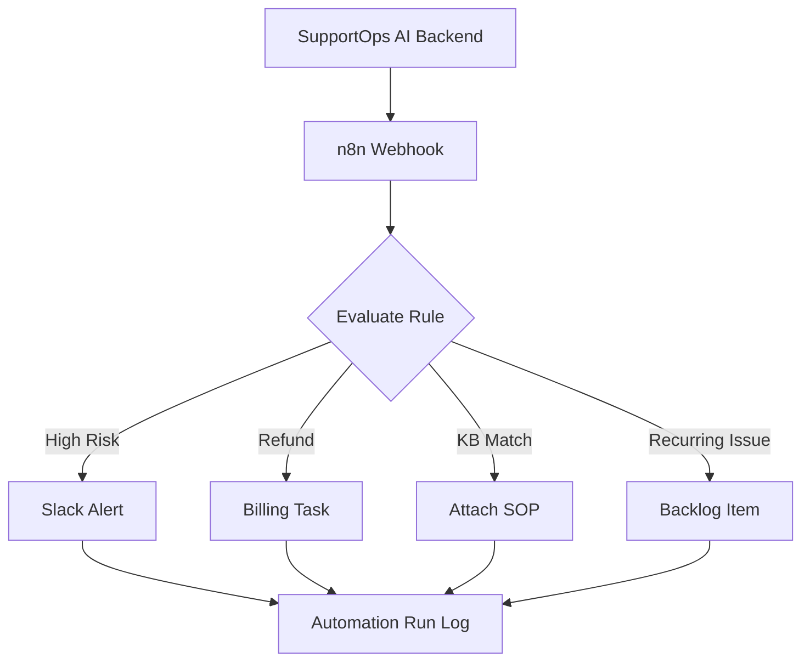

# Automation Playbook

This document defines the first automation workflows for SupportOps AI.

The current MVP simulates automation rules in the browser. The production version should run these through n8n or another workflow automation tool.

## Automation Principles

Automations should be:

- Clear
- Auditable
- Easy to pause
- Easy for support leads to understand
- Triggered by structured ticket data
- Connected to a real operational action

The goal is not to automate everything.

The goal is to automate repetitive handoffs and reduce missed follow-through.

## Rule 1: Escalate High-Risk Negative Tickets

### Purpose

Make sure urgent, negative, SLA-risk tickets are seen quickly by the right team lead.

### Trigger

Ticket triage completed.

### Conditions

```json
{
  "priority": "High",
  "sentiment": "Negative",
  "sla_status": "At risk"
}
```

### Action

Send alert to support lead channel.

Example destination:

```text
Slack #support-leads
```

### Payload

```json
{
  "ticket_id": "SUP-1048",
  "customer": "Maya Santos",
  "company": "Northline Realty",
  "subject": "Payment receipt missing after successful billing",
  "priority": "High",
  "sentiment": "Negative",
  "sla_status": "At risk",
  "summary": "Customer completed payment but did not receive proof of payment or listing activation.",
  "next_action": "Validate payment, resend receipt, activate listing, and confirm next update time."
}
```

### Success Criteria

- Slack message is sent.
- Automation run is logged.
- Ticket timeline shows escalation event.

## Rule 2: Route Refund Requests

### Purpose

Move billing and refund requests to the right operational queue.

### Trigger

Ticket triage completed.

### Conditions

```json
{
  "category": "Refund"
}
```

### Action

Create billing task or send to billing queue.

Example destination:

```text
Billing Operations queue
```

### Success Criteria

- Billing handoff is created.
- Ticket timeline shows billing route.
- Agent sees the next action.

## Rule 3: Attach Knowledge Base Matches

### Purpose

Help the agent use the right SOP without searching manually.

### Trigger

Knowledge matches generated.

### Conditions

```json
{
  "knowledge_match_count": {
    "greater_than": 0
  }
}
```

### Action

Attach top matching articles to the ticket intelligence panel.

### Success Criteria

- Ticket detail shows top matches.
- Match reason or score is visible.
- Agent can open the article.

## Rule 4: Log Recurring Process Issues

### Purpose

Convert repeated support issues into process improvement work.

### Trigger

Ticket triage completed.

### Conditions

```json
{
  "recurring_signal": true
}
```

Recurring signals may include:

- Billing sync issue
- Duplicate charge
- MFA lockout
- Export timeout
- Repeated CRM mismatch
- Repeated entitlement activation failure

### Action

Create backlog item in process improvement tracker.

Example destination:

```text
Process Improvement Backlog
```

### Success Criteria

- Backlog item is created.
- Related ticket IDs are attached.
- Issue category and suggested fix are stored.

## n8n Workflow Map



## Standard Automation Run Record

Every automation run should save:

- Automation rule ID
- Ticket ID
- Trigger time
- Input payload
- Destination
- Run status
- Output payload
- Error message if failed

## Failure Handling

If automation fails:

1. Mark run as failed.
2. Store error message.
3. Show event in ticket activity.
4. Notify Operations Admin if the rule is business-critical.
5. Allow manual retry.

## Next Concrete Action

Create the first n8n webhook workflow for high-risk negative ticket escalation.

