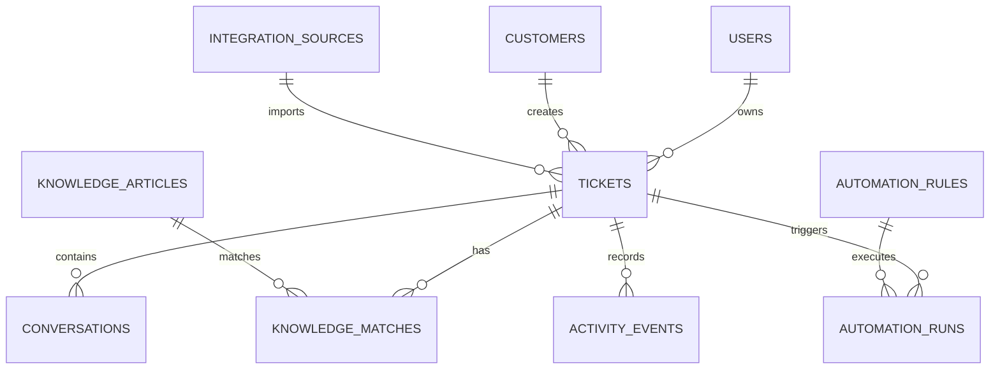

# Data Model

This document defines the planned production data model for SupportOps AI.

The current MVP uses local JavaScript objects. The production version should use a relational database, with Supabase Postgres as the recommended first backend.

## Data Model Goals

The database should support:

- Ticket intake from email, CRM, helpdesk, and webhook sources
- AI triage results
- Customer conversation history
- Knowledge base matching
- Automation rule evaluation
- Automation run logs
- Insights and reporting
- Role-based access control

## Core Entities



## Tables

### users

Stores support users and role context.

| Field | Type | Purpose |
|---|---|---|
| id | uuid | Primary key. |
| email | text | User email. |
| full_name | text | Display name. |
| role | text | Support Agent, Team Lead, or Operations Admin. |
| status | text | Active, invited, or disabled. |
| created_at | timestamptz | Record creation time. |
| updated_at | timestamptz | Last update time. |

### customers

Stores customer and company information.

| Field | Type | Purpose |
|---|---|---|
| id | uuid | Primary key. |
| name | text | Customer contact name. |
| company | text | Customer company or account name. |
| email | text | Customer email address. |
| segment | text | Customer segment or business type. |
| crm_account_id | text | External CRM account reference. |
| created_at | timestamptz | Record creation time. |
| updated_at | timestamptz | Last update time. |

### integration_sources

Stores data intake sources.

| Field | Type | Purpose |
|---|---|---|
| id | uuid | Primary key. |
| name | text | Source name. |
| source_type | text | Email, CRM, helpdesk, webhook, or form. |
| provider | text | Gmail, Outlook, HubSpot, Salesforce, Zendesk, Freshdesk, n8n, or custom. |
| status | text | Connected, planned, paused, or error. |
| sync_mode | text | Polling, webhook, manual import, or real time. |
| last_sync_at | timestamptz | Last successful sync. |
| config | jsonb | Non-secret configuration. |
| created_at | timestamptz | Record creation time. |
| updated_at | timestamptz | Last update time. |

### tickets

Stores support tickets and AI-enriched fields.

| Field | Type | Purpose |
|---|---|---|
| id | uuid | Primary key. |
| external_id | text | External ticket or case ID. |
| customer_id | uuid | Link to customer. |
| integration_source_id | uuid | Source that created the ticket. |
| owner_id | uuid | Assigned support user. |
| subject | text | Ticket subject. |
| preview | text | Short message preview. |
| channel | text | Email, chat, portal, CRM, or webhook. |
| status | text | Open, pending, resolved, or closed. |
| category | text | Billing, Access, Refund, Reporting, Feedback, Technical, or Other. |
| priority | text | Low, Medium, High, or Critical. |
| sentiment | text | Positive, Mixed, Negative, or Unknown. |
| sla_status | text | On track, At risk, Breached, or Not set. |
| urgency_score | integer | Numeric triage score from 0 to 100. |
| ai_summary | text | Short AI-generated issue summary. |
| next_action | text | Recommended next support action. |
| response_draft | text | Draft customer response. |
| raw_payload | jsonb | Original source payload. |
| created_at | timestamptz | Record creation time. |
| updated_at | timestamptz | Last update time. |

### conversations

Stores ticket conversation messages and internal notes.

| Field | Type | Purpose |
|---|---|---|
| id | uuid | Primary key. |
| ticket_id | uuid | Linked ticket. |
| author_type | text | Customer, agent, system, or internal note. |
| author_name | text | Message author. |
| body | text | Message content. |
| message_type | text | Email, chat, note, AI output, or automation event. |
| external_message_id | text | Optional source message ID. |
| created_at | timestamptz | Message time. |

### knowledge_articles

Stores SOPs, policies, runbooks, and playbooks.

| Field | Type | Purpose |
|---|---|---|
| id | uuid | Primary key. |
| title | text | Article title. |
| category | text | Billing, Access, Refund, Reporting, Feedback, Technical, or Other. |
| article_type | text | SOP, policy, runbook, checklist, or playbook. |
| status | text | Draft, published, archived. |
| summary | text | Short article summary. |
| body | text | Full article content. |
| steps | jsonb | Ordered handling steps. |
| tags | text[] | Search and matching tags. |
| embedding | vector | Optional pgvector embedding. |
| created_by | uuid | User who created article. |
| created_at | timestamptz | Record creation time. |
| updated_at | timestamptz | Last update time. |

### knowledge_matches

Stores article matches for each ticket.

| Field | Type | Purpose |
|---|---|---|
| id | uuid | Primary key. |
| ticket_id | uuid | Linked ticket. |
| knowledge_article_id | uuid | Matched article. |
| match_score | numeric | Match confidence score. |
| match_reason | text | Why the article matched. |
| created_at | timestamptz | Match creation time. |

### automation_rules

Stores automation rule definitions.

| Field | Type | Purpose |
|---|---|---|
| id | uuid | Primary key. |
| name | text | Automation rule name. |
| description | text | Rule purpose. |
| status | text | Active, paused, or archived. |
| trigger_type | text | Ticket created, triage updated, SLA risk, manual run, or scheduled. |
| conditions | jsonb | Rule logic. |
| actions | jsonb | Workflow actions. |
| destination | text | Slack, CRM, billing queue, backlog, or ticket panel. |
| created_at | timestamptz | Record creation time. |
| updated_at | timestamptz | Last update time. |

### automation_runs

Stores automation execution history.

| Field | Type | Purpose |
|---|---|---|
| id | uuid | Primary key. |
| automation_rule_id | uuid | Linked automation rule. |
| ticket_id | uuid | Linked ticket. |
| status | text | Queued, success, failed, skipped. |
| input_payload | jsonb | Payload sent to the workflow. |
| output_payload | jsonb | Workflow response. |
| error_message | text | Error details if failed. |
| started_at | timestamptz | Start time. |
| finished_at | timestamptz | Finish time. |

### activity_events

Stores timeline activity for audit and reporting.

| Field | Type | Purpose |
|---|---|---|
| id | uuid | Primary key. |
| ticket_id | uuid | Optional linked ticket. |
| user_id | uuid | Optional linked user. |
| event_type | text | Triage, automation, article, assignment, import, status change. |
| title | text | Short event title. |
| description | text | Event detail. |
| metadata | jsonb | Extra event data. |
| created_at | timestamptz | Event time. |

## Recommended Enums

Use database constraints or enum tables for production.

```text
ticket_status:
  open
  pending
  resolved
  closed

priority:
  low
  medium
  high
  critical

sentiment:
  positive
  mixed
  negative
  unknown

sla_status:
  on_track
  at_risk
  breached
  not_set

category:
  billing
  access
  refund
  reporting
  feedback
  technical
  other

automation_status:
  active
  paused
  archived
```

## Example Normalized Ticket Payload

```json
{
  "source": {
    "type": "email",
    "provider": "gmail",
    "external_id": "msg_12345"
  },
  "customer": {
    "name": "Maya Santos",
    "company": "Northline Realty",
    "email": "maya@example.com"
  },
  "ticket": {
    "subject": "Payment receipt missing after successful billing",
    "message": "We paid for the premium listing this morning, but there is no receipt and the listing is still inactive.",
    "channel": "Email"
  },
  "ai_triage": {
    "category": "Billing",
    "priority": "High",
    "sentiment": "Negative",
    "sla_status": "At risk",
    "urgency_score": 91,
    "summary": "Customer completed payment but did not receive proof of payment or listing activation.",
    "next_action": "Validate payment, resend receipt, activate listing, and confirm next update time."
  }
}
```

## Starter SQL Schema

This is a starter schema for Supabase. It is intentionally simple and can be expanded during implementation.

```sql
create extension if not exists "uuid-ossp";

create table users (
  id uuid primary key default uuid_generate_v4(),
  email text not null unique,
  full_name text,
  role text not null default 'Support Agent',
  status text not null default 'active',
  created_at timestamptz not null default now(),
  updated_at timestamptz not null default now()
);

create table customers (
  id uuid primary key default uuid_generate_v4(),
  name text not null,
  company text,
  email text,
  segment text,
  crm_account_id text,
  created_at timestamptz not null default now(),
  updated_at timestamptz not null default now()
);

create table integration_sources (
  id uuid primary key default uuid_generate_v4(),
  name text not null,
  source_type text not null,
  provider text,
  status text not null default 'connected',
  sync_mode text,
  last_sync_at timestamptz,
  config jsonb not null default '{}'::jsonb,
  created_at timestamptz not null default now(),
  updated_at timestamptz not null default now()
);

create table tickets (
  id uuid primary key default uuid_generate_v4(),
  external_id text,
  customer_id uuid references customers(id),
  integration_source_id uuid references integration_sources(id),
  owner_id uuid references users(id),
  subject text not null,
  preview text,
  channel text,
  status text not null default 'open',
  category text not null default 'other',
  priority text not null default 'medium',
  sentiment text not null default 'unknown',
  sla_status text not null default 'not_set',
  urgency_score integer not null default 0 check (urgency_score >= 0 and urgency_score <= 100),
  ai_summary text,
  next_action text,
  response_draft text,
  raw_payload jsonb not null default '{}'::jsonb,
  created_at timestamptz not null default now(),
  updated_at timestamptz not null default now()
);

create table conversations (
  id uuid primary key default uuid_generate_v4(),
  ticket_id uuid not null references tickets(id) on delete cascade,
  author_type text not null,
  author_name text,
  body text not null,
  message_type text not null default 'note',
  external_message_id text,
  created_at timestamptz not null default now()
);

create table knowledge_articles (
  id uuid primary key default uuid_generate_v4(),
  title text not null,
  category text not null default 'other',
  article_type text not null default 'SOP',
  status text not null default 'published',
  summary text,
  body text,
  steps jsonb not null default '[]'::jsonb,
  tags text[] not null default '{}',
  created_by uuid references users(id),
  created_at timestamptz not null default now(),
  updated_at timestamptz not null default now()
);

create table knowledge_matches (
  id uuid primary key default uuid_generate_v4(),
  ticket_id uuid not null references tickets(id) on delete cascade,
  knowledge_article_id uuid not null references knowledge_articles(id) on delete cascade,
  match_score numeric not null default 0,
  match_reason text,
  created_at timestamptz not null default now()
);

create table automation_rules (
  id uuid primary key default uuid_generate_v4(),
  name text not null,
  description text,
  status text not null default 'active',
  trigger_type text not null,
  conditions jsonb not null default '{}'::jsonb,
  actions jsonb not null default '[]'::jsonb,
  destination text,
  created_at timestamptz not null default now(),
  updated_at timestamptz not null default now()
);

create table automation_runs (
  id uuid primary key default uuid_generate_v4(),
  automation_rule_id uuid not null references automation_rules(id),
  ticket_id uuid references tickets(id),
  status text not null default 'queued',
  input_payload jsonb not null default '{}'::jsonb,
  output_payload jsonb not null default '{}'::jsonb,
  error_message text,
  started_at timestamptz not null default now(),
  finished_at timestamptz
);

create table activity_events (
  id uuid primary key default uuid_generate_v4(),
  ticket_id uuid references tickets(id) on delete set null,
  user_id uuid references users(id) on delete set null,
  event_type text not null,
  title text not null,
  description text,
  metadata jsonb not null default '{}'::jsonb,
  created_at timestamptz not null default now()
);
```

## Indexes To Add Early

```sql
create index tickets_status_idx on tickets(status);
create index tickets_category_idx on tickets(category);
create index tickets_priority_idx on tickets(priority);
create index tickets_sla_status_idx on tickets(sla_status);
create index tickets_created_at_idx on tickets(created_at desc);
create index conversations_ticket_id_idx on conversations(ticket_id);
create index knowledge_articles_category_idx on knowledge_articles(category);
create index automation_runs_ticket_id_idx on automation_runs(ticket_id);
create index activity_events_created_at_idx on activity_events(created_at desc);
```

## Next Data Build

The first backend implementation should focus on four tables:

1. `tickets`
2. `conversations`
3. `knowledge_articles`
4. `activity_events`

That is enough to replace the local demo data while keeping the build manageable.

