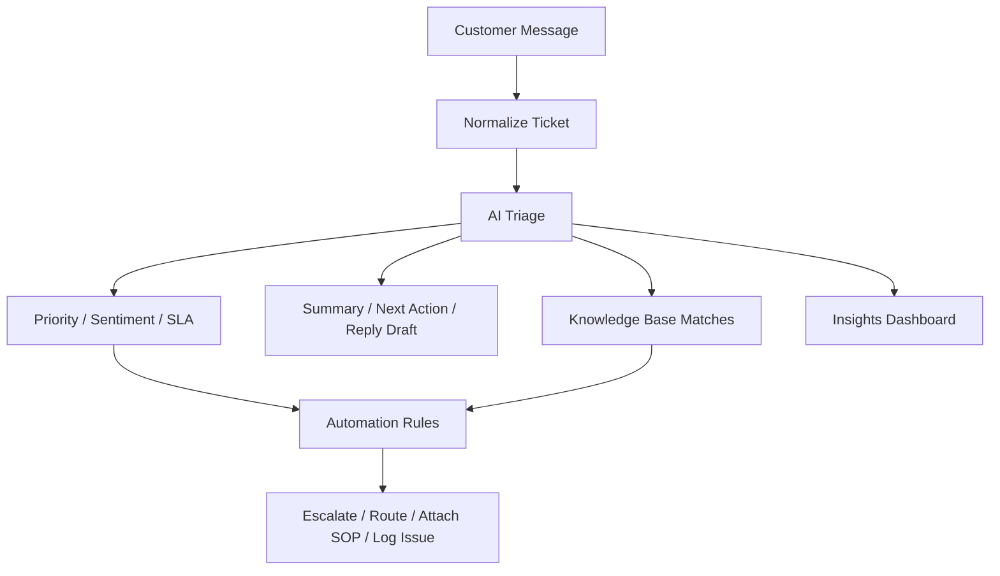

# Portfolio Case Study

## Project Name

SupportOps AI

## One-Line Summary

SupportOps AI is a customer support intelligence workspace that helps teams triage tickets, detect risk, match SOPs, draft responses, and trigger support operations automations.

## Why I Built This

Customer support teams deal with repetitive, high-volume operational work.

Agents read the same kinds of issues.

Team leads watch for SLA risk.

Operations teams look for recurring problems.

But the data is often scattered across inboxes, CRM records, helpdesk tools, spreadsheets, and internal notes.

I built SupportOps AI to show how AI and automation can turn that daily support work into a structured operating system.

## Problem

Support teams lose time and consistency because:

- Tickets arrive from multiple channels.
- Agents need to classify issues manually.
- Priority and sentiment are not always clear.
- SOPs are hard to find during active support work.
- Escalations depend on manual judgment.
- Recurring issues are noticed late.
- Process improvement opportunities stay buried in ticket history.

This creates slower resolution, inconsistent handling, and missed operational insight.

## Target Users

### Support Agent

Needs to understand a ticket quickly and respond with the right action.

### Team Lead

Needs to monitor SLA risk, negative sentiment, escalation needs, and queue health.

### Operations Admin

Needs to manage rules, handoffs, knowledge base coverage, and process improvement signals.

## Solution

SupportOps AI gives the team one workspace for:

- Ticket triage
- AI-generated summaries
- Recommended next actions
- Response drafts
- Knowledge base matches
- Automation rules
- Integration intake simulation
- Support health insights
- Process improvement backlog
- Production architecture blueprint

## Product Workflow

## Key Features

### AI Triage Lab

The user can paste a customer message and generate:

- Category
- Priority
- Sentiment
- SLA status
- Urgency score
- Summary
- Next action
- Draft response
- Suggested SOPs

### Ticket Intelligence Dashboard

The dashboard shows:

- Open ticket count
- SLA risk
- Negative sentiment
- Weekly effort avoided
- Ticket filters
- Selected ticket detail

### Knowledge Base

The knowledge base stores SOPs, policies, runbooks, and playbooks.

It supports:

- Search
- Category filtering
- Article detail
- Handling steps
- Related queue items
- New article creation

### Automation Center

The automation page models workflow rules such as:

- Escalate high-risk negative tickets.
- Route refund requests to Billing Operations.
- Attach knowledge base matches.
- Log recurring process issues.

### Integration Center

The integration page simulates data intake from:

- Support Inbox
- CRM Cases
- Helpdesk Queue
- Generic Webhook

### Insights

The insights page shows:

- Support health score
- Category mix
- SLA risk signals
- Sentiment risk
- Automation coverage
- Process backlog
- Estimated effort avoided

## Current MVP Scope

The current version is a frontend MVP.

It includes:

- Static HTML, CSS, and JavaScript
- Responsive UI
- Demo login
- Interactive ticket queue
- AI-style triage simulator
- Knowledge base module
- Integration simulator
- Automation simulator
- Insights dashboard
- Blueprint page
- Browser storage persistence

The app does not use real customer data.

The app does not require API keys.

## Production Build Plan

The next production version should include:

- Supabase for ticket, article, user, and event storage
- FastAPI backend for AI triage endpoints
- OpenAI structured outputs for ticket intelligence
- pgvector for semantic knowledge search
- n8n for workflow automation
- Slack, CRM, email, and helpdesk integrations
- Role-based access control
- Audit logs

## Business Impact

SupportOps AI is designed to improve:

- Response speed
- Ticket prioritization
- Escalation consistency
- Support quality
- SOP adoption
- Team lead visibility
- Process improvement tracking
- Automation coverage

Potential measurable outcomes:

- Lower manual triage time
- Faster escalation for SLA-risk tickets
- Higher response consistency
- More complete CRM notes
- Better visibility into recurring support issues
- More automation opportunities identified from real ticket data

## Skills Demonstrated

This project demonstrates:

- AI automation strategy
- Customer operations process design
- Workflow automation thinking
- Frontend development
- Data architecture planning
- Dashboard and UX design
- Knowledge management
- Process improvement
- Product documentation
- Portfolio storytelling

## My Role

I designed and built the MVP workflow end to end:

- Product concept
- User flows
- Ticket data model
- Triage logic
- Automation rule design
- Knowledge base structure
- Dashboard layout
- Responsive interface
- Documentation
- Production architecture plan

## Why This Fits AI And Automation Roles

This project shows the ability to connect business process improvement with technical implementation.

It is not only about building a UI.

It shows how to:

- Find repetitive operational work
- Structure the data
- Add AI where it creates value
- Trigger automation from clear rules
- Measure the operational impact
- Build a roadmap from MVP to production

## Next Concrete Action

Add a short demo video to this case study and link it from the GitHub README.

