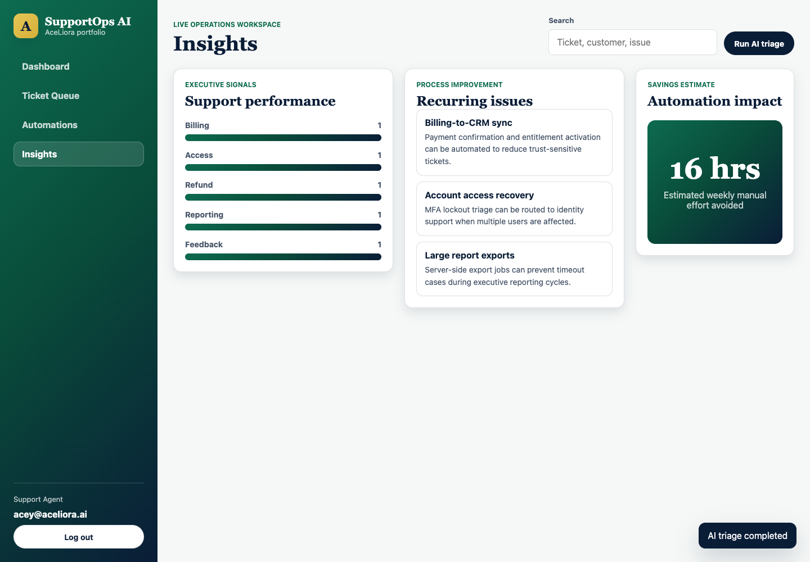
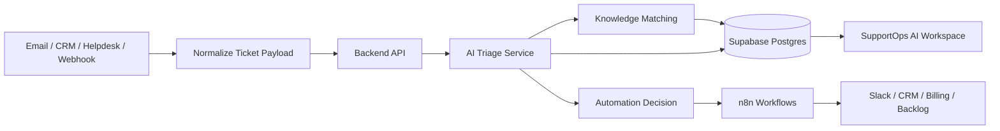

# SupportOps AI

Customer Support Intelligence and Automation Workspace

SupportOps AI is a portfolio project that shows how AI and workflow automation can improve customer support operations.

It helps a support team triage tickets, understand customer risk, match issues to knowledge base articles, trigger automation rules, and surface process improvement opportunities.

The current version is a static frontend MVP built with HTML, CSS, and JavaScript. It is designed to be easy to run, easy to review, and strong enough to demonstrate the product workflow before adding a backend.



## Project Purpose

Support teams often lose time on repetitive triage work:

- Reading long customer messages
- Deciding priority and sentiment
- Finding the right SOP or policy
- Escalating SLA risks manually
- Drafting similar replies again and again
- Logging recurring issues for process improvement

SupportOps AI turns that workflow into an intelligence layer.

The app gives support agents, team leads, and operations managers one workspace to see what needs attention, why it matters, and what action should happen next.

## What This Demonstrates

This project was built as a practical AI automation portfolio asset.

It demonstrates:

- Customer support process understanding
- AI triage workflow design
- Ticket classification logic
- Knowledge base matching
- Automation rule design
- Integration planning for email, CRM, helpdesk, and webhook intake
- Support operations dashboards
- Process improvement backlog thinking
- Clear product documentation
- Frontend execution with responsive UI

It is not just a screen mockup.

It is a working browser app with interactive workflows, local demo state, sample tickets, simulated integrations, automation rules, and a production blueprint.

## Current Status

Current build: Static portfolio MVP

Technology used today:

- HTML
- CSS
- Vanilla JavaScript
- Browser storage for demo persistence
- Deterministic AI-style triage logic
- Local sample ticket, knowledge base, integration, and automation data

No API key is required for the current version.

The AI behavior is simulated through deterministic logic so the app can be reviewed safely on GitHub without exposing paid services or credentials.

## Live Demo Locally

Run the project from the repo folder:

```bash
cd /Users/aceymagallanes/supportops-ai
python3 -m http.server 4173 --bind 127.0.0.1
```

Open:

```text
http://127.0.0.1:4173/index.html
```

You can also open `index.html` directly in a browser, but a local server is recommended.

## Demo Login

The login screen is a demo entry point.

Use the default email:

```text
acey@aceliora.ai
```

Choose one of the role cards:

- Support Agent
- Team Lead
- Operations Admin

Then click:

```text
Enter workspace
```

The role changes the user context shown inside the app. Authentication is not connected to a real identity provider in the current MVP.

## Core Product Modules

| Module | Purpose |
|---|---|
| Dashboard | Gives a live view of ticket volume, SLA risk, sentiment, automation savings, and priority tickets. |
| AI Triage | Lets a user paste a customer message and generate category, priority, sentiment, SLA status, summary, next action, and response draft. |
| Integrations | Simulates how tickets can arrive from email, CRM, helpdesk, and webhook sources. |
| Knowledge Base | Stores SOPs, policies, runbooks, and playbooks that can be matched to customer issues. |
| Ticket Queue | Shows support work in a structured queue with priority, SLA, sentiment, and owner fields. |
| Automations | Shows active and paused automation rules, matching logic, payload preview, and workflow simulation. |
| Insights | Summarizes support health, risk signals, category mix, recurring issues, and estimated effort avoided. |
| Blueprint | Documents the planned production architecture, data model, automation handoffs, and backend roadmap. |

## Main Demo Workflow

Use this flow when presenting the project:

1. Enter the workspace from the login screen.
2. Review the Dashboard metrics and priority queue.
3. Select a ticket and explain the AI-generated summary, next action, response draft, and KB matches.
4. Open AI Triage and analyze the sample urgent refund and access issue.
5. Create a new ticket from the triage result.
6. Open Knowledge Base and show how SOPs are searched and matched.
7. Open Integrations and import a sample ticket from a simulated source.
8. Open Automations and run matched automation rules for the selected ticket.
9. Open Insights and explain the support health score, risk signals, and process backlog.
10. Open Blueprint and explain how the app would connect to real data, AI services, and n8n workflows.

## Feature Detail

### 1. Dashboard

The dashboard gives a support operations view of active work.

It includes:

- Open ticket count
- SLA risk count
- Negative sentiment count
- Estimated weekly effort avoided
- Ticket search
- Ticket filters
- Ticket detail panel
- AI summary
- Recommended next action
- Draft customer response
- Conversation context
- Knowledge base matches

The goal is to help an agent move from "What is happening?" to "What should I do next?"

### 2. AI Triage

The AI Triage module accepts a customer message and generates structured ticket intelligence.

Current simulated output includes:

- Category
- Priority
- Sentiment
- SLA status
- Urgency score
- Short summary
- Next best action
- Draft response
- Suggested knowledge base matches

In the production version, this would be handled by an AI service using structured outputs.

### 3. Integration Center

The Integration Center shows how the app can receive tickets from business systems.

Planned source types:

- Gmail or Outlook support inbox
- HubSpot or Salesforce CRM cases
- Zendesk or Freshdesk helpdesk queue
- Generic webhook from n8n, Make, Zapier, or a custom form

The current version simulates these sources and lets the user import sample tickets into the queue.

### 4. Knowledge Base

The Knowledge Base module stores operational guidance.

Current article examples:

- Billing Sync Failure SOP
- Duplicate Charge and Refund Workflow
- MFA Lockout Resolution
- Large Export Timeout
- Positive Feedback Routing
- Technical Triage Checklist

Articles include:

- Category
- Type
- Status
- Tags
- Summary
- Step-by-step handling instructions
- Related queue items

In production, these articles would be stored in a database and searched with semantic matching.

### 5. Automations

The Automation Center models workflow rules that would later run through n8n or another orchestration layer.

Current automation examples:

- Escalate high-risk negative tickets to a support lead channel
- Route refund requests to Billing Operations
- Attach knowledge base matches to the ticket intelligence panel
- Log recurring issues to a process improvement backlog

The current app can simulate matched automations for the selected ticket and show the payload that would be sent to external systems.

### 6. Insights

The Insights page turns ticket data into operational intelligence.

It shows:

- Support health score
- SLA risk signals
- Sentiment risk
- High-priority ticket count
- Automation coverage
- Category mix
- Recommended process backlog
- Estimated effort avoided

This is where the project connects AI automation to business transformation.

### 7. Blueprint

The Blueprint page explains how the MVP would become a real product.

It includes:

- Data intake flow
- Core data objects
- Automation handoffs
- Backend implementation roadmap

This page is important for reviewers because it shows that the app is designed with a real architecture in mind.

## Data Architecture Summary

The current version uses local JavaScript objects as demo data.

Production data would come from:

- Email inboxes
- CRM case records
- Helpdesk platforms
- Webhooks
- Support forms
- Knowledge base systems

Production flow:

1. A customer message arrives from email, CRM, helpdesk, or webhook.
2. The app normalizes the message into a ticket payload.
3. A backend service stores the raw message and ticket metadata.
4. An AI triage service classifies the issue and generates structured output.
5. A knowledge matching service finds relevant SOPs or policies.
6. Automation rules decide whether to escalate, route, update CRM, or log an issue.
7. The frontend displays the enriched ticket and recommended action.
8. n8n or another workflow tool sends updates to Slack, CRM, billing, or operations tools.

Read the full architecture in [docs/ARCHITECTURE.md](./docs/ARCHITECTURE.md).

Read the data model in [docs/DATA_MODEL.md](./docs/DATA_MODEL.md).

## Technical Architecture

### Current MVP Architecture

```text
Browser
  |
  |-- index.html
  |-- styles.css
  |-- app.js
        |
        |-- sample ticket data
        |-- sample knowledge articles
        |-- simulated integration sources
        |-- automation rule logic
        |-- browser/session storage
```

### Target Production Architecture



## Recommended Production Stack

The recommended stack for the next build:

| Layer | Recommended Tool | Reason |
|---|---|---|
| Frontend | Next.js + TypeScript | Scalable app structure, routing, stronger maintainability. |
| Database | Supabase Postgres | Fast setup, relational data, auth, storage, and API support. |
| Vector Search | pgvector on Supabase | Useful for semantic knowledge base matching. |
| Backend API | FastAPI | Clean Python API layer for AI and automation workflows. |
| AI Layer | OpenAI API with structured outputs | Reliable structured triage output for category, sentiment, priority, SLA, and next action. |
| Workflow Automation | n8n | Strong fit for Slack, CRM, email, webhook, and operations handoffs. |
| Deployment | Vercel + Render/Fly.io/Supabase | Practical split for frontend, backend, and database. |

## Repository Structure

```text
supportops-ai/
  index.html
  styles.css
  app.js
  supportops-ai-desktop.png
  README.md
  CONTRIBUTING.md
  LICENSE
  .gitignore
  docs/
    AI_TRIAGE_SPEC.md
    ARCHITECTURE.md
    AUTOMATION_PLAYBOOK.md
    DATA_MODEL.md
    DEMO_SCRIPT.md
    GITHUB_CHECKLIST.md
    PORTFOLIO_CASE_STUDY.md
    ROADMAP.md
    SECURITY_AND_PRIVACY.md
    SETUP.md
```

## How The AI Logic Works Today

The current AI triage behavior is simulated in `app.js`.

The logic checks the customer subject and message for signals such as:

- Refund
- Duplicate billing
- Access issue
- Login lockout
- Reporting or export issue
- Positive feedback
- Urgency
- Negative sentiment

It then generates:

- Category
- Sentiment
- Priority
- SLA status
- Urgency score
- Summary
- Next action
- Draft response
- Knowledge base matches

This makes the demo reliable and easy to review.

The next step is to replace this deterministic logic with a real AI API.

## Why This Project Matters

This project is built for the kind of AI and automation role that needs both business process understanding and technical execution.

It shows the ability to:

- Understand support operations
- Find repeatable process pain
- Design an AI-assisted workflow
- Build an interactive product experience
- Think in terms of data, systems, and handoffs
- Connect automation to measurable operational impact

That combination matters.

Many teams do not need AI experiments.

They need AI built into the way work already happens.

## Portfolio Positioning

Use this description in a portfolio, LinkedIn post, or job application:

```text
SupportOps AI is a customer support intelligence workspace that helps teams triage tickets, detect SLA risk, match customer issues to SOPs, draft better responses, and trigger support operations automations.

I built it to demonstrate how AI can improve support quality, reduce manual triage, and turn recurring tickets into process improvement opportunities.
```

## Documents

| Document | Purpose |
|---|---|
| [Architecture](./docs/ARCHITECTURE.md) | Explains current MVP architecture and target production architecture. |
| [Data Model](./docs/DATA_MODEL.md) | Defines the planned database structure and ticket payload design. |
| [AI Triage Spec](./docs/AI_TRIAGE_SPEC.md) | Defines the planned structured AI output for ticket triage. |
| [Automation Playbook](./docs/AUTOMATION_PLAYBOOK.md) | Defines the first n8n-ready automation workflows. |
| [Portfolio Case Study](./docs/PORTFOLIO_CASE_STUDY.md) | Positions the project as a business transformation and AI automation case study. |
| [Demo Script](./docs/DEMO_SCRIPT.md) | Gives a clear talk track for a 2-minute or 5-minute walkthrough. |
| [Roadmap](./docs/ROADMAP.md) | Lists the build phases from static MVP to production-ready app. |
| [Security And Privacy](./docs/SECURITY_AND_PRIVACY.md) | Clarifies demo data boundaries and production security requirements. |
| [Setup](./docs/SETUP.md) | Shows how to run and troubleshoot the project locally. |
| [GitHub Checklist](./docs/GITHUB_CHECKLIST.md) | Gives the exact steps to prepare and publish the repo. |

## Roadmap Snapshot

Completed:

- Static browser MVP
- Login experience
- Ticket dashboard
- AI triage simulator
- Knowledge base module
- Integration simulator
- Automation simulator
- Insights dashboard
- Blueprint page
- Responsive UI review
- GitHub-ready documentation

Next build phase:

- Add Supabase database
- Save tickets and knowledge articles permanently
- Add FastAPI AI triage endpoint
- Replace deterministic triage with AI structured output
- Connect n8n workflow triggers

See the full roadmap in [docs/ROADMAP.md](./docs/ROADMAP.md).

## Security Notes

Current version:

- No real customer data
- No backend
- No authentication service
- No API keys
- No production integrations

Production version should add:

- Secure authentication
- Role-based access control
- Environment variables for secrets
- API rate limiting
- Audit logs
- Data retention rules
- PII handling policy
- CRM and helpdesk permission controls

## Author

Acey Magallanes

Customer Transformation and Business Transformation professional focused on AI automation, process improvement, operations excellence, and practical workflow systems.

AceLiora AI

Automate. Transform. Grow.

## License

This project is released under the MIT License.

See [LICENSE](./LICENSE).
